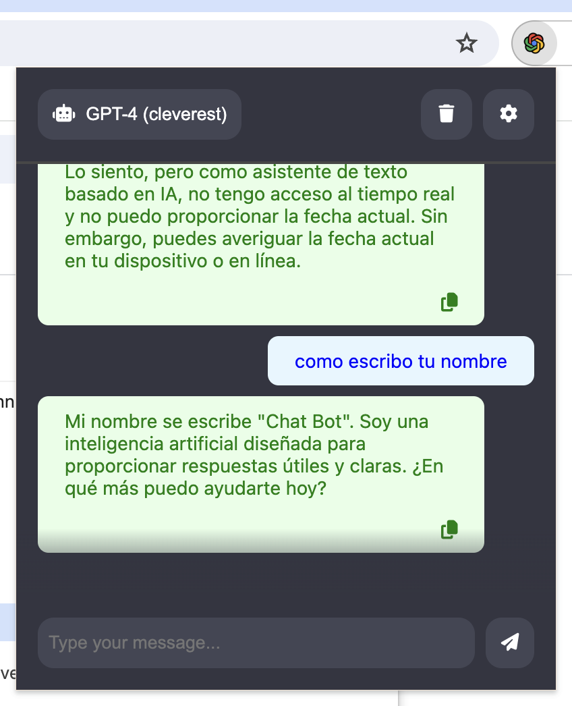
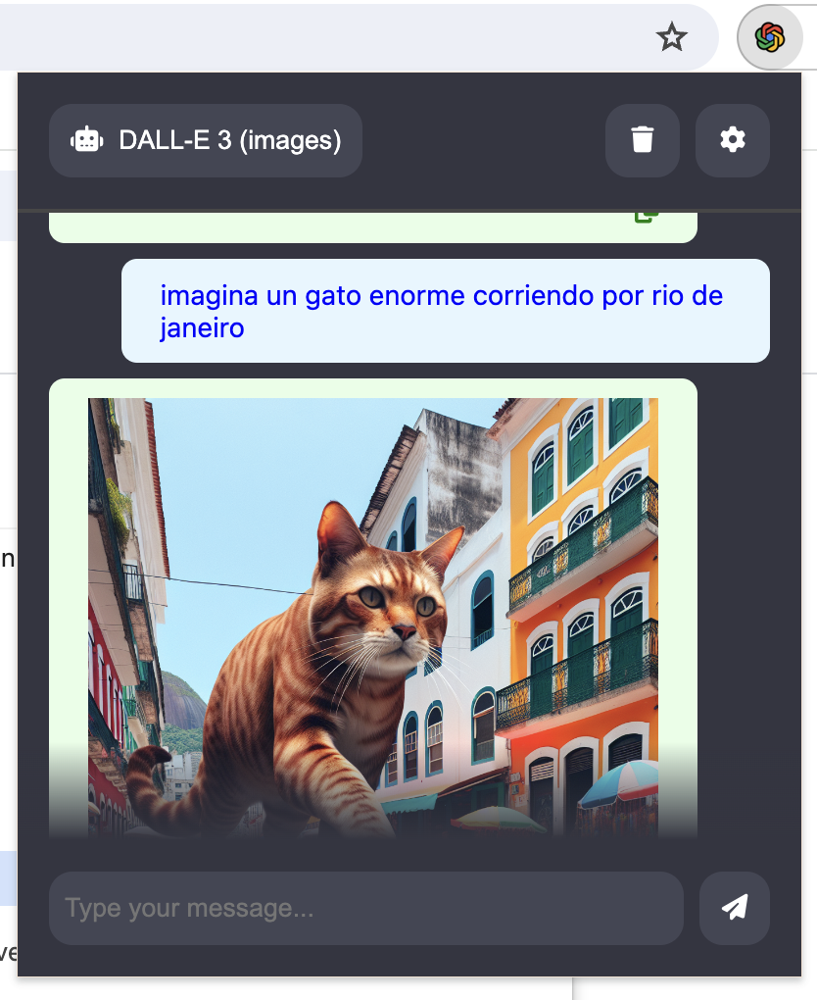

# Extensión de Chrome para OpenAI ChatGPT

Esta extensión utiliza la magia de los modelos de chat e imagen de OpenAI para garantizar una experiencia fluida similar a ChatGPT, todo sin tener que abandonar tu sitio web favorito. Inicia una conversación impulsada por A.I. o genera imágenes impresionantes con solo unos pocos clics.

## 📸 Capturas de pantalla

    
    

## ✨ Características

- 💨 Acceso fácil a los modelos de chat e imágenes de OpenAI sin salir de tu sitio web favorito.
- 💬 Chatea con los últimos modelos GPT.
- 🌄 Genera imágenes impresionantes con DALL-E 3.
- 🎛️ Cambia sin problemas entre diferentes modelos.
- 💾 Copia o descarga el contenido generado con solo un clic.
- 🛟 La clave de API se almacena de manera segura en el almacenamiento local del navegador y nunca abandona tu dispositivo.

## 🚀 Comenzando

1. Clona la extensión o descarga la última versión.
2. Abre el navegador Chrome y navega a [chrome://extensions](chrome://extensions).
3. Habilita el modo de desarrollador haciendo clic en el interruptor de palanca en la esquina superior derecha de la página.
4. Haz clic en el botón "Cargar desempaquetado" y selecciona la carpeta de extensión clonada.
5. La página de opciones se abre automáticamente donde necesitas ingresar tu clave API de OpenAI.

La extensión ahora debería estar instalada y lista para usar. Abre la extensión haciendo clic en el icono de OpenAI con temática de chrome en la esquina superior derecha de tu navegador.

## 🚨 Nota

Para que la extensión funcione, necesitas tener una clave API de OpenAI. Puedes obtener una registrándote en el [sitio web de OpenAI](https://openai.com/). Una vez que tengas una clave API, deberás ingresarla en la página de opciones de la extensión.
